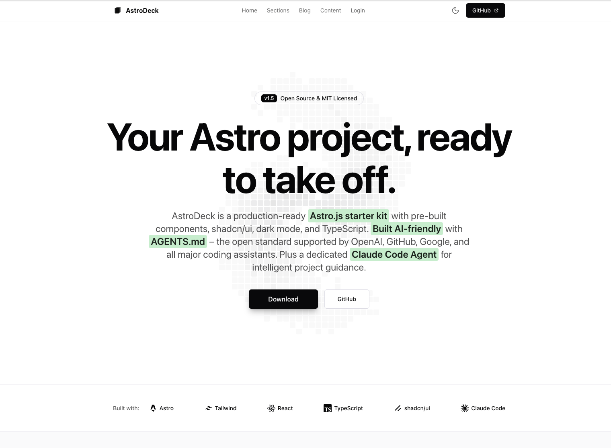

# AstroDeck

[](https://github.com/holger1411/astrodeck/releases)
[](https://astro.build)
[](LICENSE)

**A modern, open-source component library and starter kit for building stunning Astro.js websites in minutes. Built AI-friendly for seamless development with Claude, Cursor, and other coding assistants.**

AstroDeck provides pre-built, production-ready components that help you launch landing pages, SaaS websites, and marketing sites faster. Built with [Astro](https://astro.build), [Tailwind CSS](https://tailwindcss.com), and [shadcn/ui](https://ui.shadcn.com) components.



---

## 🚀 Features

- **🤖 AI-Friendly Development** - AGENTS.md standard + dedicated Claude Code Agent helps you build faster with any AI assistant
- **15+ Pre-built Sections** - Heroes, CTAs, Pricing Tables, Testimonials, Newsletters, and more
- **Multiple Layout Templates** - Boxed, Full-Width, Minimal, and Auth layouts for different page types
- **Fully Responsive** - Mobile-first design that looks great on all devices
- **Dark Mode Support** - Built-in theme switching with persistent preferences
- **TypeScript** - Full type safety throughout the codebase
- **shadcn/ui Components** - Beautiful, accessible React components integrated with Astro
- **Lightning Fast** - Astro's zero-JS by default approach for optimal performance
- **SEO Optimized** - Built-in OpenGraph, Twitter Cards, sitemap, RSS feed, and canonical URLs
- **Code Quality Tools** - ESLint and Prettier configured for Astro and TypeScript
- **Easy Customization** - Tailwind CSS for rapid styling adjustments
- **Production Ready** - Optimized builds with analytics integration

---

## 📋 Table of Contents

- [Prerequisites](#-prerequisites)
- [Quick Start](#-quick-start)
- [Installation](#-installation)
- [Development](#-development)
- [Project Structure](#-project-structure)
- [Usage Guide](#-usage-guide)
  - [Creating Pages](#creating-pages)
  - [Using Components](#using-components)
  - [Working with Layouts](#working-with-layouts)
  - [Customizing Styles](#customizing-styles)
- [Component Library](#-component-library)
- [Customization](#-customization)
- [Building for Production](#-building-for-production)
- [Deployment](#-deployment)
- [Troubleshooting](#-troubleshooting)
- [AI-Friendly Development](#-ai-friendly-development)
  - [Claude Code Agent](#claude-code-agent)
  - [AI Documentation Files](#ai-documentation-files)
- [Contributing](#-contributing)
- [License](#-license)

---

## 🔧 Prerequisites

Before you begin, ensure you have the following installed on your machine:

- **Node.js** - Version 18.17.0 or higher (latest LTS recommended)
- **npm** - Comes with Node.js (or use yarn/pnpm)
- **Git** - For cloning the repository

To check your Node.js version, run:

```bash
node --version
```

If you need to install or update Node.js, visit [nodejs.org](https://nodejs.org).

**Important:** AstroDeck uses the **latest versions** of Astro and Tailwind CSS. Always run `npm install` to get the most recent versions.

---

## ⚡ Quick Start

Get AstroDeck running in 3 steps:

```bash
# 1. Create a new project using degit
npx degit holger1411/astrodeck my-project
cd my-project

# 2. Install dependencies
npm install

# 3. Start the development server
npm run dev
```

Open your browser and navigate to `http://localhost:4321` to see your site!

---

## 📦 Installation

### Option 1: Using degit (Recommended)

The fastest way to get started - no git history, clean project:

```bash
# Create a new project
npx degit holger1411/astrodeck my-project
cd my-project

# Install dependencies
npm install

# Start developing
npm run dev
```

### Option 2: Download Release ZIP

Download the latest release directly:

```bash
# Download the latest version
wget https://github.com/holger1411/astrodeck/archive/refs/tags/v1.5.1.zip

# Extract
unzip v1.5.1.zip
cd astrodeck-1.5.1

# Install and run
npm install
npm run dev
```

### Option 3: Clone from GitHub

```bash
# Clone the repository
git clone https://github.com/holger1411/astrodeck.git my-project

# Navigate into the directory
cd astrodeck

# Install dependencies
npm install
```

### Option 4: Use as a Template

1. Click the **"Use this template"** button on GitHub
2. Create a new repository from the template
3. Clone your new repository
4. Install dependencies with `npm install`

### Option 5: Manual Download

1. Download the ZIP file from GitHub
2. Extract it to your desired location
3. Open terminal in the extracted folder
4. Run `npm install`

---

## 🛠️ Development

### Starting the Development Server

```bash
npm run dev
```

This command:
- Starts a local development server
- Watches for file changes and auto-reloads
- Makes your site available at `http://localhost:4321`
- Provides hot module replacement for instant updates

**Expected output:**

```
  🚀  astro  v5.x.x started in 234ms

  ┃ Local    http://localhost:4321/
  ┃ Network  use --host to expose
```

**Note:** Version numbers will vary based on your installed Astro version. AstroDeck always uses the latest stable release.

### Alternative Start Command

```bash
npm start
```

This is an alias for `npm run dev` and does the same thing.

### Development Tips

- **Auto-reload**: Changes to `.astro`, `.tsx`, and `.css` files trigger automatic browser refresh
- **Error handling**: Check the terminal for build errors and warnings
- **Port in use?**: If port 4321 is busy, Astro will automatically use the next available port

---

## 📁 Project Structure

Understanding the folder structure helps you navigate and customize AstroDeck:

```
astrodeck/
├── public/                 # Static assets (fonts, images, favicon)
│   ├── favicon.svg
│   └── fonts/
├── src/
│   ├── components/         # Reusable components
│   │   ├── sections/       # Page sections (Hero, CTA, etc.)
│   │   │   ├── Hero.astro
│   │   │   ├── CTA.astro
│   │   │   ├── Features.astro
│   │   │   ├── Pricing.astro
│   │   │   ├── Testimonials.astro
│   │   │   ├── LogoCloud.astro
│   │   │   └── ContentBlock.astro
│   │   ├── ui/             # shadcn/ui components
│   │   │   ├── button.tsx
│   │   │   ├── card.tsx
│   │   │   ├── badge.tsx
│   │   │   ├── input.tsx
│   │   │   └── label.tsx
│   │   ├── Header.astro    # Main site header
│   │   ├── Footer.astro    # Main site footer
│   │   ├── ThemeToggle.astro
│   │   └── LoginForm.tsx   # Example React component
│   ├── layouts/            # Page layout templates
│   │   ├── BaseLayout.astro      # Boxed layout (max-w-5xl)
│   │   ├── FullWidthLayout.astro # Full-width layout
│   │   ├── MinimalLayout.astro   # No header/footer (404, standalone)
│   │   ├── AuthLayout.astro      # Auth pages (no header/footer)
│   │   └── ArticleLayout.astro   # Blog/article layout
│   ├── pages/              # File-based routing
│   │   ├── index.astro     # Homepage (/)
│   │   ├── sections.astro  # Section library (/sections)
│   │   ├── blog/           # Blog pages
│   │   ├── 404.astro       # Custom 404 page
│   │   ├── login.astro     # Login page (/login)
│   │   ├── privacy.astro   # Privacy page (/privacy)
│   │   └── rss.xml.ts      # RSS feed endpoint
│   ├── styles/             # Global styles
│   │   └── globals.css     # Tailwind + custom styles
│   ├── lib/                # Utilities
│   │   └── utils.ts        # Helper functions
│   └── env.d.ts            # TypeScript definitions
├── astro.config.mjs        # Astro configuration
├── tailwind.config.mjs     # Tailwind CSS configuration
├── tsconfig.json           # TypeScript configuration
└── package.json            # Dependencies and scripts
```

### Key Directories Explained

- **`src/pages/`** - Each `.astro` file becomes a route (index.astro → `/`, login.astro → `/login`)
- **`src/components/sections/`** - Copy-paste ready sections for building pages
- **`src/layouts/`** - Wrapper templates that provide consistent structure
- **`public/`** - Files served as-is (no processing)

---

## 📖 Usage Guide

### Creating Pages

Astro uses file-based routing. Create a new file in `src/pages/` to add a new route.

**Example: Creating an About page**

Create `src/pages/about.astro`:

```astro
---
import BaseLayout from "@/layouts/BaseLayout.astro";
---

<BaseLayout
  title="About Us"
  description="Learn more about our mission and team"
>
  <div class="py-16">
    <h1 class="text-4xl font-bold mb-6">About AstroDeck</h1>
    <p class="text-lg text-muted-foreground">
      We're building the best component library for Astro.
    </p>
  </div>
</BaseLayout>
```

Now visit `http://localhost:4321/about` to see your new page!

### Using Components

AstroDeck components are modular and easy to use. Import them into your pages.

**Example: Adding a Hero section**

```astro
---
import BaseLayout from "@/layouts/BaseLayout.astro";
import Hero from "@/components/sections/Hero.astro";
import Features from "@/components/sections/Features.astro";
---

<BaseLayout title="Home" description="Welcome to our website">
  <Hero />
  <Features />
</BaseLayout>
```

**Example: Using UI components**

```astro
---
import { Button } from "@/components/ui/button";
import { Badge } from "@/components/ui/badge";
---

<div>
  <Badge>New</Badge>
  <h2>Featured Product</h2>
  <Button>Get Started</Button>
</div>
```

### Working with Layouts

Layouts provide consistent page structure. AstroDeck includes several layouts:

#### 1. BaseLayout (Boxed)

Centered content with max-width constraint. Best for content-focused pages.

```astro
---
import BaseLayout from "@/layouts/BaseLayout.astro";
---

<BaseLayout title="My Page" description="Page description">
  <!-- Content is centered with max-w-5xl -->
  <h1>Welcome</h1>
</BaseLayout>
```

#### 2. FullWidthLayout

Full-width layout for showcase pages. Used in the sections library.

```astro
---
import FullWidthLayout from "@/layouts/FullWidthLayout.astro";
---

<FullWidthLayout title="Sections" description="Component library">
  <!-- Content spans full width -->
</FullWidthLayout>
```

#### 3. AuthLayout

Minimal layout without header/footer. Perfect for login, signup, and auth flows.

```astro
---
import AuthLayout from "@/layouts/AuthLayout.astro";
---

<AuthLayout title="Login">
  <!-- No header or footer, just your content -->
  <LoginForm />
</AuthLayout>
```

#### 4. MinimalLayout

Full-width layout without header or footer. Ideal for standalone pages like 404, maintenance, or landing pages.

```astro
---
import MinimalLayout from "@/layouts/MinimalLayout.astro";
---

<MinimalLayout title="Page Not Found" noindex={true}>
  <!-- Complete control over the viewport -->
  <div class="flex items-center justify-center min-h-screen">
    <h1>404 - Page Not Found</h1>
  </div>
</MinimalLayout>
```

### Customizing Styles

AstroDeck uses Tailwind CSS for styling. Here's how to customize:

#### Changing Colors

AstroDeck uses **Tailwind CSS v4** with the modern **OKLCH color format**. Edit `src/styles/globals.css`:

```css
@theme {
  /* Light mode colors */
  --color-background: oklch(100% 0 0);
  --color-foreground: oklch(9.8% 0.0016 286.75);
  --color-primary: oklch(11.2% 0.0079 286.75);      /* Change this */
  --color-primary-foreground: oklch(98% 0.0011 286.75);
  /* ... more colors */
}

.dark {
  /* Dark mode overrides */
  --color-background: oklch(1.5% 0 0);
  --color-foreground: oklch(98% 0 0);
  --color-primary: oklch(98% 0 0);                   /* Dark mode primary */
  --color-primary-foreground: oklch(1.5% 0 0);
  /* ... more colors */
}
```

**OKLCH Format:** `oklch(lightness% chroma hue)`
- **Lightness:** 0-100% (0 = black, 100 = white)
- **Chroma:** Color intensity (0 = grayscale, higher = more vivid)
- **Hue:** Color angle in degrees (0-360)

#### Adding Custom Fonts

1. Add font files to `public/fonts/`
2. Update `src/styles/globals.css`:

```css
@font-face {
  font-family: 'MyFont';
  src: url('/fonts/MyFont.woff2') format('woff2');
}

body {
  font-family: 'MyFont', sans-serif;
}
```

#### Custom CSS Classes

Add global styles to `src/styles/globals.css`:

```css
.custom-gradient {
  background: linear-gradient(135deg, #667eea 0%, #764ba2 100%);
}
```

Then use in components:

```astro
<div class="custom-gradient p-12">
  <h1>Custom styled section</h1>
</div>
```

---

## 🎨 Component Library

AstroDeck includes 15+ production-ready sections. Visit `/sections` in your browser to see all components with live previews.

### Available Sections

#### Hero Sections (3 variants)
- **Centered with Badge** - Classic hero with announcement badge
- **Left Aligned** - Split layout with content and visual
- **Minimal with Stats** - Clean design with social proof metrics

#### Call-to-Action (3 variants)
- **Simple Centered** - Focused conversion section
- **Split with Features** - CTA with feature highlights
- **Banner Style** - Bottom banner for conversions

#### Pricing Tables (4 variants)
- **AstroDeck Open Source** - Free tier showcase
- **Three Column** - Standard pricing grid
- **Comparison Table** - Feature comparison layout
- **Monthly/Yearly Toggle** - Pricing with billing toggle

#### Testimonials (3 variants)
- **Grid Layout** - Multiple testimonials in a grid
- **Featured Single** - Highlight one customer story
- **Horizontal Scroll** - Scrollable testimonial cards

#### Newsletters (3 variants)
- **Simple Inline** - Classic email capture
- **Split with Visual** - Newsletter with image
- **Bottom Bar** - Minimal footer signup

### Using Sections in Your Pages

Copy any section from `/sections` or use them directly:

```astro
---
import BaseLayout from "@/layouts/BaseLayout.astro";
import Hero from "@/components/sections/Hero.astro";
import Pricing from "@/components/sections/Pricing.astro";
import CTA from "@/components/sections/CTA.astro";
---

<BaseLayout title="Pricing" description="Choose your plan">
  <Hero />
  <Pricing />
  <CTA />
</BaseLayout>
```

---

## 🎨 Customization

### Theme Configuration

AstroDeck uses CSS variables for theming, making it easy to switch between light and dark modes.

#### Customizing Theme Colors

Edit `src/styles/globals.css` using the **OKLCH color format** (Tailwind v4):

```css
@theme {
  /* Light mode colors */
  --color-background: oklch(100% 0 0);
  --color-foreground: oklch(9.8% 0.0016 286.75);
  --color-primary: oklch(11.2% 0.0079 286.75);
  --color-primary-foreground: oklch(98% 0.0011 286.75);
  --color-secondary: oklch(96.1% 0.0011 286.75);
  --color-muted: oklch(96.1% 0.0011 286.75);
  /* Add more custom colors */
}

.dark {
  /* Dark mode overrides */
  --color-background: oklch(1.5% 0 0);
  --color-foreground: oklch(98% 0 0);
  --color-primary: oklch(98% 0 0);
  --color-primary-foreground: oklch(1.5% 0 0);
}
```

**Why OKLCH?** Better perceptual uniformity than HSL. Colors appear more consistent to the human eye.

### Modifying Components

All components are open and customizable. Simply edit the files in `src/components/`.

**Example: Customizing the Hero**

Edit `src/components/sections/Hero.astro`:

```astro
<section class="py-20 px-6">
  <div class="max-w-7xl mx-auto text-center">
    <h1 class="text-6xl font-bold mb-6">
      Your Custom Headline Here
    </h1>
    <p class="text-xl text-muted-foreground mb-8">
      Your custom description
    </p>
    <a href="/signup" class="btn btn-primary">
      Get Started Free
    </a>
  </div>
</section>
```

### Adding Analytics

AstroDeck includes Vercel Analytics integration. To enable:

1. Deploy to Vercel
2. Analytics are automatically enabled

For other analytics platforms:

**Google Analytics:**

Add to `src/layouts/BaseLayout.astro`:

```astro
<head>
  <!-- Existing head content -->
  <script async src="https://www.googletagmanager.com/gtag/js?id=GA_MEASUREMENT_ID"></script>
  <script>
    window.dataLayer = window.dataLayer || [];
    function gtag(){dataLayer.push(arguments);}
    gtag('js', new Date());
    gtag('config', 'GA_MEASUREMENT_ID');
  </script>
</head>
```

---

## 🏗️ Building for Production

### Build Your Site

```bash
npm run build
```

This command:
- Compiles your Astro site to static HTML/CSS/JS
- Optimizes assets (images, fonts, scripts)
- Outputs production files to the `dist/` folder
- Performs TypeScript type checking

**Expected output:**

```
building client (vite)
building server (vite)
generating static routes
▶ src/pages/index.astro
  └─ /index.html (+234ms)
▶ src/pages/login.astro
  └─ /login/index.html (+12ms)

✓ Completed in 3.45s.
```

### Preview the Production Build

Test your production build locally before deploying:

```bash
npm run preview
```

This starts a local server serving your `dist/` folder at `http://localhost:4321`.

### Build Optimization Tips

- **Image Optimization**: Use Astro's `<Image />` component for automatic optimization
- **Remove unused CSS**: Tailwind automatically purges unused styles in production
- **Bundle size**: Check `dist/` folder size - should be < 500KB for most sites
- **Lighthouse scores**: Run audits with Chrome DevTools

---

## 🚀 Deployment

AstroDeck works with any static hosting provider. Here are the most popular options:

### Deploy to Vercel (Recommended)

**Why Vercel?**
- Free for personal projects
- Automatic deployments from Git
- Built-in analytics
- Global CDN

**Steps:**

1. Push your code to GitHub

```bash
git init
git add .
git commit -m "Initial commit"
git branch -M main
git remote add origin https://github.com/yourusername/your-repo.git
git push -u origin main
```

2. Visit [vercel.com](https://vercel.com)
3. Click "Import Project"
4. Select your GitHub repository
5. Click "Deploy"

**Done!** Your site is live in ~30 seconds.

### Deploy to Netlify

1. Push to GitHub (see above)
2. Visit [netlify.com](https://netlify.com)
3. Click "Add new site" → "Import an existing project"
4. Connect GitHub and select your repo
5. Build settings (auto-detected):
   - Build command: `npm run build`
   - Publish directory: `dist`
6. Click "Deploy"

### Deploy to Cloudflare Pages

```bash
# Install Wrangler CLI
npm install -g wrangler

# Login to Cloudflare
wrangler login

# Deploy
npx wrangler pages deploy dist
```

### Deploy to GitHub Pages

1. Install the GitHub Pages adapter:

```bash
npm install --save-dev @astrojs/github-pages
```

2. Update `astro.config.mjs`:

```js
import { defineConfig } from 'astro/config';

export default defineConfig({
  site: 'https://yourusername.github.io',
  base: '/your-repo-name',
});
```

3. Create `.github/workflows/deploy.yml`:

```yaml
name: Deploy to GitHub Pages

on:
  push:
    branches: [main]

jobs:
  build:
    runs-on: ubuntu-latest
    steps:
      - uses: actions/checkout@v3
      - uses: actions/setup-node@v3
        with:
          node-version: 18
      - run: npm ci
      - run: npm run build
      - uses: peaceiris/actions-gh-pages@v3
        with:
          github_token: ${{ secrets.GITHUB_TOKEN }}
          publish_dir: ./dist
```

4. Enable GitHub Pages in your repository settings

### Other Platforms

AstroDeck works with:
- **AWS Amplify** - Connect GitHub and deploy
- **Render** - Static site hosting
- **Digital Ocean App Platform**
- **Firebase Hosting**
- **Surge.sh** - Simple CLI deployment

All require the same build settings:
- **Build command**: `npm run build`
- **Publish directory**: `dist`
- **Node version**: 18 or higher

---

## 🔍 Troubleshooting

### Common Issues and Solutions

#### Port Already in Use

**Problem:** `Error: listen EADDRINUSE: address already in use :::4321`

**Solution:**
```bash
# Kill the process using port 4321
lsof -ti:4321 | xargs kill

# Or use a different port
npm run dev -- --port 3000
```

#### Module Not Found Errors

**Problem:** `Cannot find module '@/components/...'`

**Solution:**
```bash
# Delete node_modules and reinstall
rm -rf node_modules package-lock.json
npm install
```

#### Dark Mode Not Working

**Problem:** Theme toggle doesn't switch modes

**Solution:**
1. Check browser console for JavaScript errors
2. Ensure `ThemeToggle.astro` script is running
3. Clear browser cache and localStorage

#### Build Fails with TypeScript Errors

**Problem:** `tsc` errors during build

**Solution:**
```bash
# Check for type errors
npm run build

# Fix import paths - use @/ for src directory
# Wrong: import Header from '../components/Header.astro'
# Right: import Header from '@/components/Header.astro'
```

#### Styles Not Applying

**Problem:** Tailwind classes not working

**Solution:**
1. Check if file is included in `tailwind.config.mjs`:
```js
content: ['./src/**/*.{astro,html,js,jsx,md,mdx,svelte,ts,tsx,vue}']
```
2. Restart dev server after config changes
3. Check for typos in class names

### Getting Help

- **Documentation**: [docs.astro.build](https://docs.astro.build)
- **GitHub Issues**: [Report a bug](https://github.com/yourusername/astrodeck/issues)
- **Discord**: [Join Astro community](https://astro.build/chat)

---

## 🤖 AI-Friendly Development

AstroDeck is designed to work seamlessly with AI coding assistants like Claude, ChatGPT, Cursor, GitHub Copilot, and others. We've included specialized documentation to help AI tools understand the project structure and provide better assistance.

### Claude Code Agent

AstroDeck includes a dedicated **Claude Code Agent** that acts as your personal project expert. The agent understands AstroDeck's architecture, conventions, and best practices—helping you build faster while maintaining quality.

#### What the Agent Does

| Category | Features |
|----------|----------|
| **🔧 Development** | Create pages, components, layouts following project patterns |
| **🎨 Design System** | Maintain color, spacing, and typography consistency |
| **🛡️ Security** | Warn about XSS, missing SRI, insecure resources |
| **♿ Accessibility** | Check WCAG compliance, contrast ratios, ARIA labels |
| **🔍 SEO** | Verify meta tags, OpenGraph, heading hierarchy |
| **⚡ Performance** | Identify unoptimized images, missing lazy loading |

#### Using the Agent

The agent is located at `.claude/agents/astrodeck.md` and works automatically with [Claude Code](https://claude.ai/code).

**Automatic Usage:**
When you work on AstroDeck with Claude Code, the agent activates automatically for relevant tasks.

**Explicit Usage:**
```
> Use the astrodeck agent to create a new pricing page
> Have astrodeck review my component for accessibility issues
> Ask astrodeck to check the SEO of this page
```

**Model Selection:**
The agent supports different models based on your needs:
- **Sonnet** (default): Balanced for most development tasks
- **Opus**: Complex architectural decisions and deep analysis
- **Haiku**: Quick lookups and simple operations

```
> Use astrodeck with opus to review the project architecture
```

#### Agent Capabilities

**Proactive Warnings:**
The agent warns you before potential issues become problems:

```
🛡️ SECURITY WARNING
Issue: External script without Subresource Integrity (SRI)
Risk: Script could be modified by attackers
Fix: Add integrity attribute or host script locally

♿ ACCESSIBILITY WARNING  
Issue: Image missing alt text
Impact: Screen readers cannot describe the image
Fix: Add descriptive alt attribute

🔍 SEO WARNING
Issue: Page missing OpenGraph meta tags
Impact: Poor social media sharing appearance
Fix: Add og:title, og:description, og:image
```

**DRY Enforcement:**
The agent detects code duplication and suggests improvements:

```
⚠️ DRY WARNING
Similar code found in:
- src/components/sections/Hero.astro
- src/components/sections/CTA.astro

Recommendation: Extract into a reusable component
```

#### Recommended MCP Servers

For the best experience, the agent can leverage these optional MCP servers:

**Context7** (Documentation):
```json
// For up-to-date Astro, Tailwind, React, shadcn/ui docs
// https://github.com/upstash/context7
```

**Lighthouse MCP** (Audits):
```json
{
  "mcpServers": {
    "lighthouse": {
      "command": "npx",
      "args": ["@danielsogl/lighthouse-mcp@latest"]
    }
  }
}
```

### AI Documentation Files

AstroDeck follows the **[AGENTS.md standard](https://agents.md)** – an open format for guiding AI coding agents, used by **60,000+ open-source projects** and stewarded by the Linux Foundation.

> *Think of AGENTS.md as a README for AI agents: a dedicated, predictable place to provide context and instructions.*

#### Supported AI Coding Assistants

| Tool | Support | Notes |
|------|---------|-------|
| [OpenAI Codex](https://openai.com/codex/) | ✅ Native | Reads AGENTS.md automatically |
| [GitHub Copilot](https://github.com/features/copilot) | ✅ Native | Coding agent supports AGENTS.md |
| [Cursor](https://cursor.com) | ✅ Native | Reads AGENTS.md and symlinks |
| [Google Jules](https://jules.google) | ✅ Native | Full AGENTS.md support |
| [Gemini CLI](https://github.com/google-gemini/gemini-cli) | ✅ Config | Via `contextFileName` setting |
| [Windsurf](https://windsurf.com) | ✅ Native | Reads AGENTS.md automatically |
| [Zed](https://zed.dev) | ✅ Native | Priority-based file loading |
| [Claude Code](https://claude.ai/code) | ✅ Symlink | Via `PROJECT.md → AGENTS.md` |
| [Aider](https://aider.chat) | ✅ Config | Via `read: AGENTS.md` |

**Plus many more:** Factory, Amp, RooCode, Devin, Kilo Code, Warp, and others.  
→ [See full list at agents.md](https://agents.md)

#### File Structure

```
astrodeck/
├── PROJECT.md              # 🎯 YOUR project customizations (HIGHEST PRIORITY)
├── AGENTS.md              # 📄 AstroDeck defaults (all AI tools)
├── .cursorrules           # 🔗 Symlink → AGENTS.md (Cursor)
└── .claude/
    ├── agents/
    │   └── astrodeck.md   # 🤖 Claude Code Agent (quality guardian)
    ├── commands/          # ⚡ Slash commands for common tasks
    │   ├── new-page.md    #    /new-page - Create pages
    │   ├── new-section.md #    /new-section - Create components
    │   ├── audit.md       #    /audit - Quality checks
    │   └── theme.md       #    /theme - Customize colors
    └── skills/
        └── readme/        # 📚 Project documentation skill
```

#### `PROJECT.md` - Your Project Customization File ⭐

**Priority: HIGHEST** - Overrides all other AI documentation.

Use this file to customize AstroDeck for YOUR project:

**🎨 Design Customizations:**
```markdown
## Colors
Primary color: Vibrant electric blue (#0066FF) instead of default blue
```

**✍️ Content Guidelines:**
```markdown
## Tone of Voice
- Style: Professional but friendly, conversational
- Audience: Tech-savvy startup founders
- Language: US English, avoid jargon
```

**🚀 Project-Specific Rules:**
```markdown
## Component Preferences
- All forms must include Zod validation
- All API calls must use TanStack Query
```

**Example Use Case:**
You want electric blue as your primary color. Add this to `PROJECT.md`:

```markdown
## Design Customizations
Our brand color is electric blue (#0066FF). Use this for:
- All CTAs and primary buttons
- Link colors
- Active states and highlights
```

Now every AI assistant will use electric blue instead of AstroDeck's default!

See `PROJECT.md` for a complete template with examples.

#### `AGENTS.md` - AstroDeck Defaults

The main configuration file containing:
- Project overview and tech stack (Astro v5, Tailwind v4)
- Code conventions and patterns
- Import aliases and file organization
- Do's and Don'ts for code generation
- Component templates and debugging checklists

**Note:** Instructions in `PROJECT.md` override these defaults.

#### `.claude/agents/astrodeck.md` - Claude Code Agent

Lightweight agent with AstroDeck-specific capabilities:
- Proactive security, accessibility, SEO, performance warnings
- Quick reference to AGENTS.md conventions
- Streamlined for fast activation

**Usage:** Automatically activated when using Claude Code on AstroDeck.

#### `.claude/commands/` - Slash Commands

Pre-built commands for common tasks:

| Command | Description |
|---------|-------------|
| `/new-page` | Create a new page with layout and SEO setup |
| `/new-section` | Create a reusable section component |
| `/audit` | Run quality checks (lint, accessibility, SEO) |
| `/theme` | Customize design tokens and colors |

**Usage:** Type the command in Claude Code to activate.

### Benefits of AI-Friendly Documentation

**For Developers:**
- ✅ Faster code generation that follows project conventions
- ✅ Consistent code style across AI-assisted changes
- ✅ Better suggestions from AI tools
- ✅ Reduced debugging time
- ✅ Easier onboarding for new contributors

**For AI Assistants:**
- 🎯 Understanding of project structure and patterns
- 🎯 Knowledge of tech stack specifics (Tailwind v4, Astro v5)
- 🎯 Awareness of coding conventions (imports, styling, types)
- 🎯 Context for generating appropriate solutions
- 🎯 Ability to provide better explanations

### How to Use

When working with AI assistants on AstroDeck:

1. **Ask specific questions** - AI tools have context from documentation files
2. **Reference conventions** - AI will follow the patterns defined in `.cursorrules`
3. **Request code generation** - AI understands component structure and will generate compatible code
4. **Debug with context** - AI knows common pitfalls and can suggest fixes

### Example Interactions

```
You: "Create a new pricing section component"
AI: *Generates component following AstroDeck patterns*
    - Uses @/ imports
    - Includes TypeScript types
    - Applies proper styling with Tailwind v4
    - Follows responsive design patterns
    - Matches existing component structure
```

```
You: "Why am I getting Tailwind errors?"
AI: *Checks against AGENTS.md knowledge*
    - Recognizes Tailwind v4 is used
    - Knows about @theme configuration
    - Suggests OKLCH color format
    - References globals.css structure
```

### Contributing AI Improvements

If you find ways to improve AI assistance for AstroDeck:

1. Suggest updates to `AGENTS.md` for better conventions
2. Improve the Claude Code agent in `.claude/agents/astrodeck.md`
3. Report AI-related issues or confusions
4. Share successful AI interaction patterns

**We believe AI-assisted development should be a first-class experience!**

---

## 🤝 Contributing

We welcome contributions! Here's how you can help:

### Reporting Bugs

1. Check if the issue already exists
2. Create a new issue with:
   - Clear description
   - Steps to reproduce
   - Expected vs actual behavior
   - Screenshots if applicable

### Suggesting Features

1. Open an issue with the "enhancement" label
2. Describe the feature and its use case
3. Discuss implementation approach

### Submitting Pull Requests

1. Fork the repository
2. Create a feature branch:
   ```bash
   git checkout -b feature/amazing-feature
   ```
3. Make your changes
4. Test thoroughly
5. Commit with clear messages:
   ```bash
   git commit -m "Add amazing feature"
   ```
6. Push to your fork:
   ```bash
   git push origin feature/amazing-feature
   ```
7. Open a Pull Request

### Development Guidelines

- Follow the existing code style
- Use TypeScript for type safety
- Test on both light and dark modes
- Ensure responsive design (mobile, tablet, desktop)
- Update documentation for new features

---

## 📄 License

AstroDeck is open source software licensed under the [MIT License](LICENSE).

This means you can:
- ✅ Use commercially
- ✅ Modify
- ✅ Distribute
- ✅ Use privately

**Attribution is appreciated but not required!**

---

## 🙏 Acknowledgments

AstroDeck is built with amazing open-source projects:

- [Astro](https://astro.build) - The web framework for content-driven websites
- [Tailwind CSS](https://tailwindcss.com) - Utility-first CSS framework
- [shadcn/ui](https://ui.shadcn.com) - Beautifully designed components
- [Radix UI](https://www.radix-ui.com) - Unstyled, accessible components
- [Lucide Icons](https://lucide.dev) - Beautiful icon library

---

## 🌟 Support

If you find AstroDeck helpful, please:

- ⭐ Star the repository on GitHub
- 🐦 Share it on social media
- 📝 Write about it on your blog
- 🤝 Contribute improvements


---

**Built with ❤️ by the AstroDeck team**

Start building your next amazing website today! 🚀
